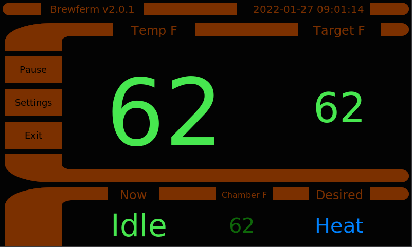

This is a temperature controller for a fermentation chamber designed for a rpi with a touchscreen. It controls both heat and cooling relays using a dual-loop PID controller. It requires two one-wire temperature sensors, one for the beer and one for the chamber. A third sensor is supported for ambient temperature outside the chamber.



This should, but hasn't been tested, to work with HDMI out on the rpi. I've developed against a touch-screen LCD with dimension 640x480.

It has the capability to control the temperature of the beer within 0.1F, although it would normally be tuned looser to save energy. The target temperature and the sensor assignments are maintained through the GUI. Presently the parameters for the two PID controllers (beer and chamber) are in the python code. The ability to adjust the PID parameters is the next development step.

```
sudo apt install bluetooth libbluetooth-dev libglib2.0-dev
sudo pip3 install bluepy

sudo apt install nginx python3-flask
sudo pip3 install gattlib glib-2.0
sudo pip3 install mariadb
sudo pip3 install simple-pid
sudo pip3 install flask uwsgi

sudo cp services/brewferm-*.service /lib/systemd/system/

sudo systemctl daemon-reload

sudo systemctl enable brewferm-sensors.service
sudo systemctl enable brewferm-relays.service
sudo systemctl enable brewferm-gui.service
sudo systemctl enable brewferm-controller.service

sudo systemctl start brewferm-sensors.service
sudo systemctl start brewferm-relays.service
sudo systemctl start brewferm-gui.service
sudo systemctl start brewferm-controller.service

sudo systemctl status brewferm-sensors.service
sudo systemctl status brewferm-relays.service
sudo systemctl status brewferm-gui.service
sudo systemctl status brewferm-controller.service

cat /home/pi/brewferm/logs/*.log
```

I'll be adding diagrams but for now:
  * If you're not qualified to work with high voltages, hire someone qualified
  * Hook up a Solid-State Relay (SSR) of at least 25amps to pins defined in relays.py statement ' myrelays = BrewfermRelays(cool_pin, heat_pin)'
  * Hook up one-wire sensors
  * Use 'Settings'->'Assign Sensors' screen to assign a sensor to a function. Clicking the button next to the sensor id will cycle through available functions. 
