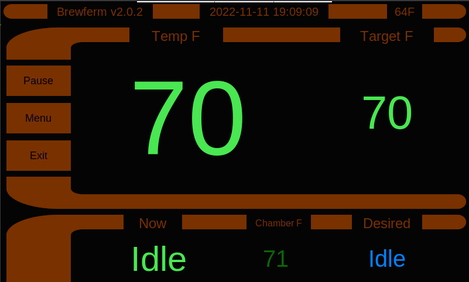
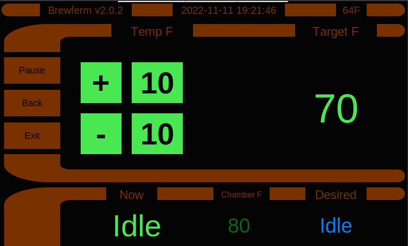
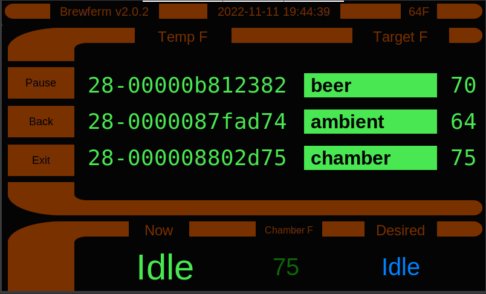

# Fermentation Temperature Controller in Python on RPI

## Main Screen

Across the top of the screen, left to right, is the program version, the current date and time, and the ambient temperature.

In the middle section, from left to right are the action buttons, the current wort temperature, and the target wort temperature.

The action buttons, from top to bottom are the **Pause/Resume** button, the settings **Menu** button, and the application **Exit** button.

The bottom section, left to right is the current **Heat/Idle/Cool** status of the fermentation chamber relays, the current **Chamber Temperature**, and the desired **Heat/Idle/Cool** status output from the PID controller. The current status may differ from desired status because the system is still in it's startup settle down time, or the heating or cooling has already run for it's full on-time in it's on/off duty cycle, or the minimum time for switching form heat to cool or from cool to heat hasn't passed yet.

## Settings Menu

## Target Wort Temperature

## Sensor Assignment

## Sensor Calibration

## PI(D) Settings

